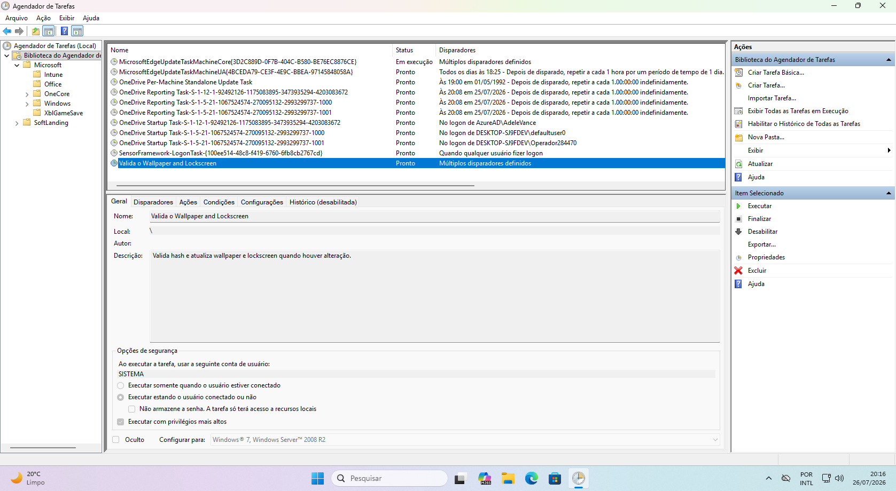
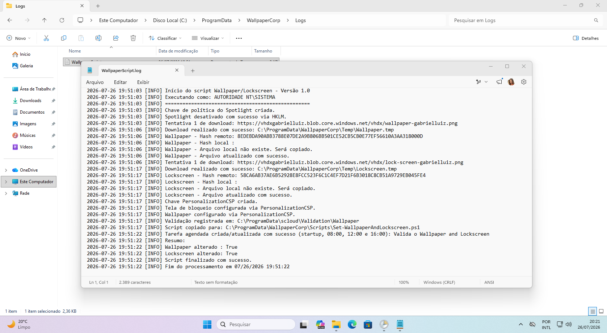

# Melhorias adicionadas ao novo script Wallpaper e Lockscreen

A nova versão recebeu melhorias importantes para tornar o gerenciamento das imagens mais simples, rápido e automatizado.

O script agora verifica o hash das imagens aplicadas no Windows. Caso a imagem armazenada na origem seja substituída ou alterada, o script identifica automaticamente a mudança, realiza um novo download e aplica a versão atualizada no dispositivo.

Isso significa que não é necessário alterar o nome do arquivo ou recriar o pacote no Microsoft Intune. Basta substituir a imagem na origem, mantendo o mesmo nome, para que a atualização seja realizada automaticamente.

Também foi adicionada uma tarefa no **Agendador de Tarefas do Windows**, configurada para executar diariamente nos seguintes horários:
•	08h;
•	12h;
•	16h.

Durante essas execuções, o script verifica se existem alterações nas imagens e, quando necessário, realiza o download e a aplicação da nova versão.

Outra melhoria importante foi a **criação de um arquivo de log**, que registra as verificações, downloads, atualizações e demais atividades realizadas pelo script. Isso facilita o acompanhamento e a solução de possíveis problemas durante a implantação.

Além disso, foi desenvolvido um script de remoção que exclui todas as configurações criadas pela solução, incluindo arquivos, imagens e tarefas agendadas. Essa opção pode ser utilizada, por exemplo, quando a empresa decidir migrar para a política nativa de aplicação de wallpaper disponibilizada pelo Microsoft Intune.

## **Conteúdos:**

Script Wallpaper e Lockscreen no Intune-V2.ps1

Script de remoção do Wallpaper e Lockscreen no Intune-V2.ps1

## **Mais informações:**

**Para maior entendimento para execução deste aplicativo acesse o link do artigo:  https://gabrielluiz.com/2025/10/from-scripting-to-customization-deploying-wallpapers-and-lockscreens-in-intune/**

**Créditos - Gabriel Luiz - www.gabrielluiz.com**
